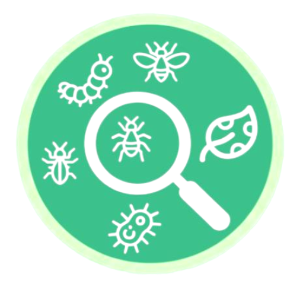

# 🌾 FarmCare - Smart Agricultural Intelligence

<p align="center">
  
</p>

<p align="center">
  <strong>Protecting harvests with AI-powered technology</strong><br/>
  Real-time pest detection • IoT sensor monitoring • Market intelligence
</p>

<p align="center">
  <a href="#features">Features</a> •
  <a href="#tech-stack">Tech Stack</a> •
  <a href="#getting-started">Getting Started</a> •
  <a href="#project-structure">Structure</a> •
  <a href="#api-integrations">APIs</a>
</p>

---

## 🎯 Overview

FarmCare is a comprehensive agricultural intelligence platform designed to help farmers in Africa and beyond protect their crops, optimize yields, and make data-driven decisions. The platform combines AI-powered pest detection, real-time environmental monitoring, and market trend analysis into a single, intuitive interface.

## ✨ Features

### 🔬 AI Pest Detection
- **Image & Video Analysis**: Upload crop images or videos for instant pest identification
- **Browser-Based Detection**: On-device AI processing using Hugging Face transformers
- **Cloud Detection**: Server-side analysis for higher accuracy
- **Infestation Level Assessment**: Automated severity classification (low, moderate, high, critical)

### 📡 IoT Sensor Integration
- **Real-time Monitoring**: Track soil moisture, temperature, humidity, and light intensity
- **Automated Alerts**: Get notified when sensor readings exceed safe thresholds
- **Historical Data**: View trends and patterns in your farm's environmental data

### 🌤️ Weather Intelligence
- **7-Day Forecasts**: Accurate weather predictions for your farm location
- **Weather-Based Alerts**: Frost warnings, heat advisories, and storm notifications
- **Agricultural Recommendations**: Weather-informed farming suggestions

### 📊 Market Trends
- **Price Tracking**: Monitor crop prices across local markets
- **Trend Analysis**: Identify optimal selling windows
- **Community Submissions**: Crowdsourced price data from farmers

### 🛒 Farm Store
- **Agricultural Products**: Seeds, fertilizers, tools, and equipment
- **Shopping Cart**: Full e-commerce functionality
- **Multi-Country Checkout**: Support for 24 African countries

### 👥 Expert Directory
- **Agronomist Network**: Connect with certified agricultural experts
- **Consultation Booking**: Schedule voice or video consultations
- **Twilio Integration**: SMS and call alerts for critical pest detections

### 💬 AI Farm Assistant
- **24/7 Chat Support**: AI-powered agricultural advice
- **Voice Input**: Speech-to-text for hands-free operation
- **Image Analysis**: Upload photos for instant crop diagnosis

## 🛠️ Tech Stack

| Category | Technology |
|----------|------------|
| **Framework** | React 18 + TypeScript |
| **Build Tool** | Vite |
| **Styling** | Tailwind CSS + shadcn/ui |
| **State Management** | TanStack Query |
| **Backend** | Supabase (Lovable Cloud) |
| **AI/ML** | Hugging Face Transformers, OpenAI |
| **Authentication** | Supabase Auth (Email, Phone OTP) |
| **Database** | PostgreSQL (via Supabase) |
| **Edge Functions** | Deno (Supabase Edge Functions) |
| **File Storage** | Supabase Storage |
| **Notifications** | Twilio (SMS & Voice) |
| **Weather API** | Open-Meteo |

## 📁 Project Structure

```
farmcare/
├── public/                    # Static assets
│   ├── farmcare-logo.png
│   └── og-image.png
├── src/
│   ├── assets/               # Images and media
│   │   ├── experts/          # Expert profile photos
│   │   └── hero-farm-background.jpg
│   ├── components/           # Reusable UI components
│   │   ├── ui/               # shadcn/ui components
│   │   ├── AIChatWidget.tsx  # AI assistant chat
│   │   ├── CartDrawer.tsx    # Shopping cart
│   │   ├── Layout.tsx        # Main layout wrapper
│   │   └── WeatherCard.tsx   # Weather display
│   ├── contexts/             # React contexts
│   │   ├── AuthContext.tsx   # Authentication state
│   │   └── CartContext.tsx   # Shopping cart state
│   ├── hooks/                # Custom React hooks
│   │   └── useFarmAdvisorStatus.ts
│   ├── pages/                # Route pages
│   │   ├── admin/            # Admin dashboard pages
│   │   ├── farmer/           # Farmer dashboard pages
│   │   │   ├── Analysis.tsx  # Pest detection results
│   │   │   ├── Dashboard.tsx # Main farmer dashboard
│   │   │   ├── Upload.tsx    # Image/video upload
│   │   │   ├── Weather.tsx   # Weather forecasts
│   │   │   └── ...
│   │   ├── Auth.tsx          # Login/Signup
│   │   ├── Landing.tsx       # Marketing homepage
│   │   └── ...
│   ├── utils/                # Utility functions
│   │   ├── browserPestDetection.ts  # Client-side AI
│   │   ├── farmAdvisor.ts    # Recommendation engine
│   │   ├── sensorAlerts.ts   # Sensor threshold checks
│   │   └── weatherAlerts.ts  # Weather alert logic
│   └── integrations/
│       └── supabase/         # Supabase client & types
├── supabase/
│   ├── functions/            # Edge functions
│   │   ├── chat-assistant/   # AI chat endpoint
│   │   ├── detect-pest/      # Pest detection API
│   │   ├── send-twilio-alert/# SMS/Voice alerts
│   │   └── speech-to-text/   # Voice transcription
│   └── config.toml           # Supabase configuration
└── ...
```

## 🚀 Getting Started

### Prerequisites
- Node.js 18+ 
- npm or bun

### Installation

```bash
# Clone the repository
git clone <your-repo-url>
cd farmcare

# Install dependencies
npm install

# Start development server
npm run dev
```

The app will be available at `http://localhost:5173`

## 🔐 Environment Variables

The following environment variables are automatically configured by Lovable Cloud:

- `VITE_SUPABASE_URL` - Supabase project URL
- `VITE_SUPABASE_PUBLISHABLE_KEY` - Supabase anon key
- `VITE_SUPABASE_PROJECT_ID` - Project identifier

### Edge Function Secrets

Configure these in Lovable Cloud settings:
- `OPENAI_API_KEY` - For speech-to-text functionality
- `TWILIO_ACCOUNT_SID` - Twilio account identifier
- `TWILIO_AUTH_TOKEN` - Twilio authentication
- `TWILIO_PHONE_NUMBER` - Sender phone number
- `LOVABLE_API_KEY` - AI chat functionality

## 📊 Database Schema

| Table | Description |
|-------|-------------|
| `farms` | Farm profiles with location and size |
| `sensor_data` | IoT sensor readings (moisture, temp, humidity, light) |
| `analysis_reports` | Pest detection results and history |
| `alerts` | System notifications and warnings |
| `profiles` | User profiles with roles |
| `user_roles` | Role-based access control |
| `market_price_submissions` | Crowdsourced crop prices |
| `agronomist_contacts` | Expert consultation records |

## 🌍 Internationalization

FarmCare supports multiple languages:
- 🇬🇧 English
- 🇳🇬 Hausa
- 🇳🇬 Yoruba
- 🇫🇷 French
- 🇪🇸 Spanish

## 🤝 User Roles

| Role | Access |
|------|--------|
| **Farmer** | Dashboard, pest detection, weather, market trends, store |
| **Agronomist** | Admin dashboard, analysis review, farm management |

## 📱 Key Pages

- `/` - Landing page (marketing)
- `/auth` - Login/Signup
- `/farmer/dashboard` - Main farmer dashboard
- `/farmer/upload` - Upload images for pest detection
- `/farmer/analysis` - View detection results
- `/farmer/weather` - Weather forecasts
- `/farmer/market-trends` - Crop price analytics
- `/farmer/store` - Agricultural products shop
- `/farmer/experts` - Agronomist directory
- `/admin/dashboard` - Admin overview

## 📍 Location

**FarmCare Headquarters**  
Ogbomoso, Nigeria

## 📄 License

This project is proprietary software developed for FarmCare.

---

<p align="center">
  Built with ❤️ by FarmCare Team using <a href="https://lovable.dev">Lovable</a>
</p>
